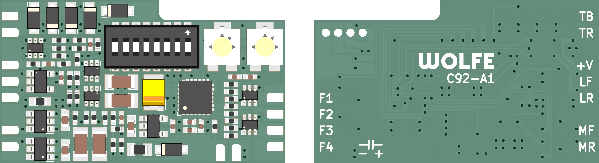

# c92-decoder

### An MM1/MM2/Lenz decoder for classic Märklin locomotives and the pre-mfx digital systems.

The c92 decoder was spawned out of a passion for the classic (pre-mfx) Märklin digital systems. The controllers of this era operated with three different protocols:
- MM1 (6020, 6021, 6022, 6023)
- MM2 (6021)
- Lenz (6027, 6029)

However, no single decoder from this era can operate on all three protocols, nor with all of their capabilities. Furthermore, there is a matrix of incompatibility between different controllers and combinations of decoders using MM1 and MM2. The c92 decoder is a superset of all decoder capabilities and their respective protocols; a universal classic decoder.



### Cloning

This project uses [`slonket-footprints`](https://github.com/slonket/slonket-footprints) as a submodule for all PCB designs. All KiCAD projects within this repository are configured to use the submodule libraries with local paths. Run the following to clone the repository with its submodule:
```
git clone --recurse-submodules https://github.com/slonket/c92-decoder.git
```